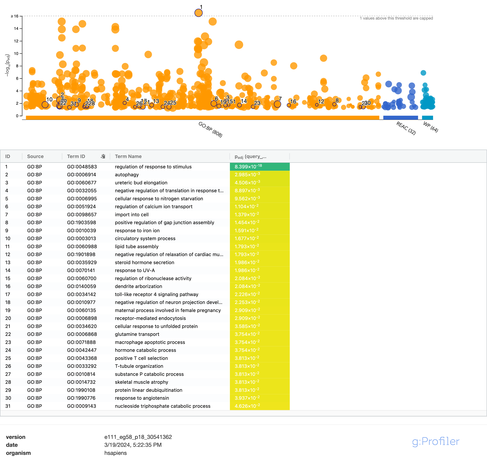
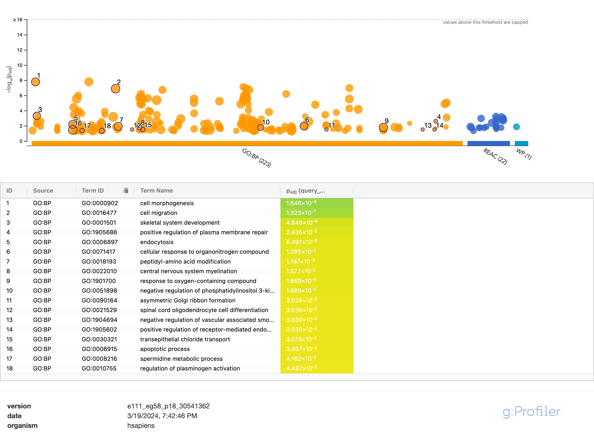

# A1 Summary

|       Previously, we downloaded bulk RNAseq data from the GEO datasetid GSE233622. This data is associated with Goyal et al's paper titled "Diverse clonal fates emerge upon drug treatment of homogeneous cancer cells", which was published in Nature on July 19th, 2023. WM989 A6-G3 human melanoma cells with a V600E BRAF mutation were treated with either 1µM of vemurafenib or 5µM of trametinib. This causes the emergence of drug resistant cells in 1 in 10000 cells. (1)
|       67 resistant clones were then isolated, expanded, and categorized into five groups based on their morphology: naive (untreated control), small, onTop, notOnTop, or uncategorized. 57 small and slow proliferating (small) cells and faster proliferating (onTop and notOnTop) cell samples were used for downstream normalization while 10 naive or uncategorized samples were removed. onTop and notOnTop refers to whether the colonies had cells growing on top of one another or not. (1)
|       Prior to normalization by EdgeR, genes with low counts were filtered out using a minimal number of samples of 56 and counts per million (CPM) of each gene across samples. Prior to filtering, 52745 genes were present, this was reduced to 11403 genes after filtering. With the filtered dataset, trimmed mean of M-value normalization was applied using EdgeR (calcNormFactors).
|       An MDS plot of the normalized samples showed separation between small and onTop/notOnTop samples. Since drug conditions, cell line, and sample treatments were identical between the samples, morphology is the only differing factor that can be used for the model. A biological coefficient of variance (BCV) plot showed the trended dispersion estimates followed the common dispersion across average log(CPM). Additionally, the plotted mean variance plot verified that the data set closely followed a negative binomial distribution. 
|       Lastly, using the hsapiens_gene_ensembl dataset, the ensembl gene ids were mapped and merged to the normalized dataset. Only 31 genes were not successfully mapped. 

# Model Design 
For the differential expression analysis, the model will compare expression between small and onTop/notOnTop samples. There are no other differentiating factors between samples as mentioned in the summary and there is good seperation between the groups, as illustrated in the MDS plot below. Since onTop and notOnTop do not seperate, for ease in downstream analysis they will be grouped as "large". 
```{r, include = FALSE}
# Packages
library(edgeR)
library(limma)

# First, loading in normalized data and grouping information from the first assignment 

# Normalized data (CPM) w/ and w/o mapping
normalized_data_UNMAPPED <- read.table(file.path(getwd(), "GSE233622", "GSE233622_CPM_normalized_filtered_RSEM_counts.txt"), sep = "\t", row.names = 1)
normalized_data_MAPPED <- read.table(file.path(getwd(), "GSE233622", "GSE233622_MAPPED_normalized_filtered_RSEM_counts.txt"), sep = "\t", row.names = 1)

#unnormalized to make a DGE container 
unnormalized <- read.table(file.path(getwd(), "GSE233622", "GSE233622_unnormalized_filtered_RSEM_counts.txt"), sep = "\t", row.names = 1)

# Morphology grouping information for each sample
grouping_info <- read.table(file.path(getwd(), "GSE233622", "GSE233622_grouping_information_morphologies.txt"), sep = "\t",row.names = 1)
```

## MDS plot 

Limma and EdgeR were used for normalization, MDS plot construction, and model design. (2) (3)

```{r, fig.cap = "Figure 1: MDS plot illustrating dismiliarity of low-count filtered bulk RNAseq data of drug resistant WM989 A6-G3 V600E clone cells. Samples are coloured by their morphology."}
# Code from first assignment to create a DGE container 

d = DGEList(counts = unnormalized, group = grouping_info$HGdata.colonyTypeFine)

d = calcNormFactors(d)

# MDS
limma::plotMDS(d, labels = NULL, pch = 1, col = c("red3", "purple3", "orange2")[factor(grouping_info$HGdata.colonyTypeFine)], main = "MSD Plot of drug resistant WM989 A6-G3 V600E clone samples")

# Legend
legend("top", legend=levels(factor(grouping_info$HGdata.colonyTypeFine)), pch=c(1), col= c("red3", "purple3", "orange2"),title = "Morphology", bty = 'n', cex = 0.75)

# Grouping onTop and notOnTop together as "large"
grouping_info[grouping_info == "onTop" | grouping_info == "notOnTop" ] <- "large"

# Rerun with onTop + notOnTop being changed to "large"
d_large = DGEList(counts = as.matrix(unnormalized), group = grouping_info$HGdata.colonyTypeFine)
d_large = calcNormFactors(d_large)

# Model Matrix + Dispersion
model_design <- model.matrix(~grouping_info$HGdata.colonyTypeFine)
d_colonytype <- estimateDisp(d_large, model_design)
```

# Differential Gene Expression 

EdgeR, ComplexHeatmaps, and circilize was used for differential gene expression analysis. (3) (4) (5)

### Question 1
**1. Calculate p-values for each of the genes in your expression set. How many genes were significantly differentially expressed? What thresholds did you use and why?**

P-values for each gene were calculated using glmQLFit with 7057 genes being significantly differentially expressed between small and large morphology clones. A threshold of 0.05 was used since the authors of the original paper used it for their comparisons of bulk RNAseq expression to their scRNAseq data. However, even after correction, many of these genes were still significant therefore more filtering was done to focus on genes with high fold changes in their expression between morphologies. This is elaborated in question 2. 

### Question 2
**2. Multiple hypothesis testing - correct your p-values using a multiple hypothesis correction method. Which method did you use? And Why? How many genes passed correction?**

The Benjamini-Hochberg was used for multiple hypothesis correction since it is not overly stringent. However, after correction, 6589 genes were still significantly differentially expressed. I wanted to focus in on genes with the most significant fold changes between small and large clones. Using glmTreat, I was able to test for genes with a log fold change of 1.5 or more in expression. Before correction, 1962 genes were significant and this was reduced to 1405 after correction. 

```{r}
# Fitting data with dispersion based on colony type 
fitted_data <- glmQLFit(d_colonytype, design = model_design)

#QLFtesting 
glfcolonytype <- glmQLFTest(fitted_data, coef = "grouping_info$HGdata.colonyTypeFinesmall")

# Displaying top hits
knitr::kable(topTags(glfcolonytype), type = "html",row.names = TRUE, caption = "Table 1: Top differentially expressed gene hits when comparing expression between small and large morphology clones")

# Storing topTags of our results 
qlf_output_hits <- topTags(glfcolonytype, sort.by = "PValue", n = nrow(normalized_data_MAPPED))

# How many genes are significant prior and after correction 
nopa1 <-length(which(qlf_output_hits$table$PValue < 0.05))
pa1 <- length(which(qlf_output_hits$table$FDR < 0.05))

# Narrowing further for geens that show a differential fold change of 2 or more 
treated <- glmTreat(fitted_data, coef = "grouping_info$HGdata.colonyTypeFinesmall", lfc = log2(1.5))

# Storing hits 
treated_hits <- topTags(treated, sort.by = "PValue", n = nrow(normalized_data_MAPPED))

# Reassessing amount of genes which are significant before and after correction 
nopa2 <- length(which(treated_hits$table$PValue < 0.05))
pa2 <- length(which(treated_hits$table$FDR < 0.05))

filt_results <- matrix(c(nopa1, nopa2, pa1, pa2), byrow = TRUE, ncol = 2)
colnames(filt_results) <- c("No log fold change filtering", "1.5 log fold change filtering")
rownames(filt_results) <- c("Significant genes before correction", "Signficant genes after correction")

knitr::kable(filt_results, type = "html", caption = "Table 2: Summarized significant gene hits before/after correction and with/without log fold change filtering")
```
### Question 3
**3. Show the amount of differentially expressed genes using an MA Plot or a Volcano plot. Highlight genes of interest.**

No specific genes of interest. 

```{r, fig.cap = " Figure 2: MA plot of differentially expressed genes between small and large clone samples. The highlighted samples have a significant adjusted p-value (Benjamini-Hochberg correction) and a log fold change differential expression of 1.5. 764 genes are downregulated and 641 were upregulated."}
diff_exp <- decideTestsDGE(treated, adjust.method = "BH")

plotMD(treated, status = diff_exp, ylab = "Log fold change expression", xlab = "Average log CPM", main = "MA Plot of differentially expressed genes with a log fold change of 1.5")
```

### Question 4
**4. Visualize your top hits using a heatmap. Do your conditions cluster together? Explain why or why not.**

The heatmap can be viewed below. The mrophologies do cluster together very strikingly. I clustered my smaples by their morphological characterization and there are four distinct quadrents across samples. Where large clones upregulate genes, the small clones downregulate them across most samples and vice versa. This is interesting to see, even though these cells underwent the same drug treatment conditions and have stable genomes as confirmed by whole genome sequencing of clones, they have similar transcriptional profiles and morphologies within groups but differ greatly between groups.

```{r}
# Creating the numeric matrix to create the heatmap 
heatmap_matrix <- as.matrix(normalized_data_MAPPED[,3:ncol(normalized_data_MAPPED)])

rownames(heatmap_matrix) <- normalized_data_MAPPED$ensembl_gene_id
colnames(heatmap_matrix) <- colnames(normalized_data_MAPPED[,3:ncol(normalized_data_MAPPED)])
```

```{r, message = FALSE, fig.cap = "Figure 3: Heat map of top gene hits (P <0.05, log fold change = 1.5) showing change in transriptional expression as compared between small and large clone samples. Columns were clustered based on morphology."}
# Heatmap code 
library(ComplexHeatmap)
library(circlize)

# Subsetting top hits from our 1.5 log fold change differential expression table 
top_hits <- rownames(treated_hits$table)[treated_hits$table$FDR < 0.05]

# Scale normalization 
heatmap_matrix_tophits <- t(scale(t(heatmap_matrix[which(rownames(heatmap_matrix) %in% top_hits),])))

# Colour assignment for heatmap 
heatmap_col = heatmap_col = colorRamp2(c(min(heatmap_matrix_tophits, na.rm = TRUE), 0,
max(heatmap_matrix_tophits, na.rm = TRUE)), c("blue", "white", "red"))

# Annotation 
morphs <- unique(grouping_info$HGdata.colonyTypeFine)
morphcol <- c("pink", "lightgreen")
names(morphcol) <- morphs

annot <- HeatmapAnnotation(df = data.frame(morphology = grouping_info$HGdata.colonyTypeFine), show_legend = TRUE,  col = list(morphology = morphcol))

# Creating dendrogram to cluster by morphology 
clust <- cluster_between_groups(heatmap_matrix_tophits, grouping_info$HGdata.colonyTypeFine)

# Heatmap 
current_heatmap <- Heatmap(heatmap_matrix_tophits, show_row_dend = TRUE, show_column_dend = FALSE, col = heatmap_col, show_column_names = TRUE, show_row_names = FALSE, show_heatmap_legend = TRUE, top_annotation = annot, cluster_columns = clust, column_title = "Top gene hits comparing small vs large morphologies", row_title = "Genes (FDR<0.05)", name = "Expression", column_title_gp = gpar(fontsize = 15, fontface = "bold"), column_names_gp = gpar(fontsize = 6))

current_heatmap
```

# Preliminary ORA 
## Making threshold and non-threshold subsets 
To begin, I have created non-threshold and threshold genelists, exporting ranked, upregulated and downregulated genes. This assignment will only use the threshold lists but I have included the non-threshold here to use in the subsequent assignment.

```{r}
# NON THRESHOLD
# Merge gene names with the top hits NOTE: using hits which prefiltered for fold log change of 1.5 or more
qlf_output_hits_withgenes <- merge(normalized_data_MAPPED[,1:2], treated_hits, by.x=1, by.y = 0)

# Ranking genes 
qlf_output_hits_withgenes[,"rank"] <- -log(qlf_output_hits_withgenes$FDR,base = 10) * sign(qlf_output_hits_withgenes$logFC)

qlf_output_hits_withgenes <- qlf_output_hits_withgenes[order(qlf_output_hits_withgenes$rank),]

# Remove genes that don't have gene symbols
qlf_output_hits_withgenes <- qlf_output_hits_withgenes[qlf_output_hits_withgenes$hgnc_symbol != "",]

# Exporting 
write.table(x = data.frame(genename = qlf_output_hits_withgenes$hgnc_symbol, F_stat= qlf_output_hits_withgenes$rank), file = file.path(getwd(),"small_vs_large_ranked_genelist.txt"), sep = "\t",row.names = FALSE, col.names = FALSE,quote = FALSE)

# THRESHOLDED 
# Upregulated genes with a corrected p-value of 0.05 or more 
upregulated_genes <- qlf_output_hits_withgenes$hgnc_symbol[which(qlf_output_hits_withgenes$FDR < 0.05 & qlf_output_hits_withgenes$logFC > 0)]

# Downregulated genes with a corrected p-value of 0.05 or more 
downregulated_genes <- qlf_output_hits_withgenes$hgnc_symbol[which(qlf_output_hits_withgenes$FDR < 0.05 & qlf_output_hits_withgenes$logFC < 0)]

# Exporting 
write.table(x = upregulated_genes, file = file.path(getwd(),"small_upregulated_genes.txt"),
sep = "\t",row.names = FALSE, col.names = FALSE,quote = FALSE)

write.table(x = downregulated_genes, file=file.path(getwd(),"small_downregulated_genes.txt"), sep = "\t",row.names = FALSE, col.names = FALSE,quote = FALSE)
```

## Implementing g:Profilier in R 
Now with our thresholded gene list, I will run ORA preliminary analysis with g:profiler below. (6) The following pipeline is implemented from Ruth Isserlin's tutorial found at the following link (https://risserlin.github.io/CBW_pathways_workshop_R_notebooks/run-gprofiler-from-r.html). (7)

### Question 1
**Which method did you choose and why?**

I chose to use g:profiler to complete my threshold gene list enrichment analysis. I chose g:profiler due to it being regularly updated quarterly, on the same schedule as Ensembl. Considering I used Ensembl to map my genes previously, using g:profiler seemed like a logical choice for continuinity and up to date data. 

### Question 2
**What annotation data did you use and why? What version of the annotation are you using?**

G:profiler pulls annotation information for several datasets. When completing my query I selected for GO annotation, Reactome, and WikiPathways. This allowed me to use manually reviewed GO annotations rather than inferred ones, for more reliable mapping. Similarly, WikiPathways has a large breath of annotations due to community contribution and Reactome has detailed entries as well. Since I was only interested in linking gene expression to pathways, I did not choose other pathways g:profiler offered, such as phenotype ontology or regulatory motifs. The specific g:profiler version I used was e111_eg58_p18_30541362. 

```{r}
# Initializing parameters and loading libraries for g:profiler 
# All generated files will be placed in current directory
working_dir <- getwd()

# Max size of genesets
max_gs_size <- 250

# Default min size of the genesets for example
min_gs_size <- 3

# Min intersection between your genelist and the geneset
min_intersection <- 3

# Using hsapiens for g:profiler to use 
organism <- "hsapiens"

#use library
tryCatch(expr = { library("gprofiler2")}, 
         error = function(e) { 
           install.packages("gprofiler2")}, 
         finally = library("gprofiler2"))

tryCatch(expr = { library("GSA")}, 
         error = function(e) { 
           install.packages("GSA")}, 
         finally = library("GSA"))

# Running g:profiler for downregulated and upregulated genes, the default threshold is 0.05 and was kept to this 
gprofiler_results_down <- gost(query = downregulated_genes ,
                          significant=FALSE,
                          ordered_query = FALSE,
                          exclude_iea=TRUE,
                          correction_method = "fdr",
                          organism = organism,
                          source = c("REAC","WP","GO:BP"))

gprofiler_results_up <- gost(query =  upregulated_genes,
                          significant=FALSE,
                          ordered_query = FALSE,
                          exclude_iea=TRUE,
                          correction_method = "fdr",
                          organism = organism,
                          source = c("REAC","WP","GO:BP"))
 
# Enrichment results 
enrichment_results_down <- gprofiler_results_down$result
enrichment_results_up <- gprofiler_results_up$result
```
At this point, the g:profiler results for both down and upregulated genes have been stored under their respective variables (enrichment_results_(up/down)). Now, the geneset file will be downloaded. 

```{r, message = FALSE}
# GMT url 
gprofiler_gmt_url <-  "https://biit.cs.ut.ee/gprofiler/static/gprofiler_full_hsapiens.name.gmt"

#get version info gprofiler as the gmt file is always associated with 
# a specific version of g:profiler
gprofiler_version <- get_version_info(organism = organism)

gprofiler_gmt_filename <- file.path(working_dir,
                                  paste("gprofiler_full", organism,
                                    gprofiler_version$gprofiler_version,sep="_",
                                    ".name.gmt"))

if(!file.exists(gprofiler_gmt_filename)){
  download.file(url = gprofiler_gmt_url, 
              destfile = gprofiler_gmt_filename)
}
```
Now, the genes associated with each geneset must be pulled.

```{r, message = FALSE}
# Loading in the g:profiler geneset file
capt_output <- capture.output(genesets_gprofiler <- GSA.read.gmt(
                                      filename = gprofiler_gmt_filename))

names(genesets_gprofiler$genesets) <- genesets_gprofiler$geneset.names
```
In order to get overlapped genes between our up/down regulated queries and the genesets, the following function, getGeneSubsets will be used. Afterwards, the enrichment results were filtered based on geneset size. Geneset size filtering allows a closer look to more specific biolgoical pathways (i.e. no filtering may give patwhays such as "cell signalling" whereas smaller filters may show "pro-apoptopic signaling")

```{r}
getGenesetGenes <- function(query_genes, subset_genesets){
  genes <- lapply(subset_genesets,FUN=function(x){intersect(x,query_genes)})
  
  # For each of the genes collapse to the comma separate text
  genes_collapsed <- unlist(lapply(genes,FUN=function(x){
                                                paste(x,collapse = ",")}))
  
  genes_collapsed_df <- data.frame(term_id = names(genes), 
                            genes = genes_collapsed,stringsAsFactors = FALSE)
  
  return(genes_collapsed_df)
}

# Filtering by geneset size, including filters of: 250, 1000, 10000 (nofiltering)

# Upregulated genes 
up_enrichment_results_mxgssize_250_min_3 <- 
                        subset(enrichment_results_up,term_size >= min_gs_size & 
                                   term_size <= max_gs_size & 
                                   intersection_size >= min_intersection , 
                                 select = c(term_id, term_name, p_value, p_value ))

up_enrichment_results_mxgssize_1000_min_3 <- 
                        subset(enrichment_results_up,term_size >= min_gs_size & 
                                   term_size <= 1000 & 
                                   intersection_size >= min_intersection , 
                                 select = c(term_id, term_name, p_value, p_value))

up_enrichment_results_mxgssize_10000_min_3 <- 
                        subset(enrichment_results_up, term_size >= min_gs_size & 
                                 term_size <= 10000 & 
                                 intersection_size >= min_intersection , 
                               select = c(term_id, term_name, p_value, p_value))
                               
# Downregulated genes 
down_enrichment_results_mxgssize_250_min_3 <- 
                        subset(enrichment_results_down,term_size >= min_gs_size & 
                                   term_size <= max_gs_size & 
                                   intersection_size >= min_intersection , 
                                 select = c(term_id, term_name, p_value, p_value ))

down_enrichment_results_mxgssize_1000_min_3 <- 
                        subset(enrichment_results_down,term_size >= min_gs_size & 
                                   term_size <= 1000 & 
                                   intersection_size >= min_intersection , 
                                 select = c(term_id, term_name, p_value, p_value))

down_enrichment_results_mxgssize_10000_min_3 <- 
                        subset(enrichment_results_down, term_size >= min_gs_size & 
                                 term_size <= 10000 & 
                                 intersection_size >= min_intersection , 
                               select = c(term_id, term_name, p_value, p_value))
```

Finally, the results will be formatted and exported. 

```{r}
createGEMformat <- function(results, gs, query_genes){
# Takes filtered gprofiler results, genes associated with each geneset(GMT), query genes, and returns a properly formatted GEM file of results. 
  if(nrow(results) >0){    

           #add phenotype to the results
          formatted_results <- cbind(results,1)
          
          # Add the genes to the genesets
          subset_genesets <- gs$genesets[
            which(gs$geneset.names 
                  %in% results$term_id)]
          
          genes <- getGenesetGenes(query_genes, subset_genesets)
          
          formatted_results <- merge(formatted_results,genes,by.x=1, by.y=1)
          
          colnames(formatted_results) <- c("name","description","p-value",
                                           "q-value","phenotype","genes")
          
  }
  return(formatted_results)
}

# Upregulated - formatting 
up_enrichment_results_mxgssize_10000_min_3_GEMfile <- createGEMformat(
  up_enrichment_results_mxgssize_10000_min_3, genesets_gprofiler, upregulated_genes)

up_enrichment_results_mxgssize_1000_min_3_GEMfile <- createGEMformat(
  up_enrichment_results_mxgssize_1000_min_3, genesets_gprofiler, upregulated_genes)

up_enrichment_results_mxgssize_250_min_3_GEMfile <- createGEMformat(
  up_enrichment_results_mxgssize_250_min_3, genesets_gprofiler, upregulated_genes)

# Downregulated - formatting 
down_enrichment_results_mxgssize_10000_min_3_GEMfile <- createGEMformat(
  down_enrichment_results_mxgssize_10000_min_3, genesets_gprofiler, downregulated_genes)

down_enrichment_results_mxgssize_1000_min_3_GEMfile <- createGEMformat(
  down_enrichment_results_mxgssize_1000_min_3, genesets_gprofiler, downregulated_genes)

down_enrichment_results_mxgssize_250_min_3_GEMfile <- createGEMformat(
  down_enrichment_results_mxgssize_250_min_3, genesets_gprofiler, downregulated_genes)

# Upregulated - export 
write.table(up_enrichment_results_mxgssize_10000_min_3_GEMfile, 
            file = file.path(working_dir, 
                "gProfiler_hsapiens_GSE233622_UPresults_GEM_termmin3_max10000.gem.txt"),
            row.names = FALSE, 
            col.names = TRUE, sep="\t",
            quote = FALSE)
write.table(up_enrichment_results_mxgssize_1000_min_3_GEMfile, 
            file = file.path(working_dir, 
                "gProfiler_hsapiens_GSE233622_UPresults_GEM_termmin3_max1000.gem.txt"),
            row.names = FALSE, 
            col.names = TRUE, sep="\t",
            quote = FALSE)
write.table(up_enrichment_results_mxgssize_250_min_3_GEMfile, 
            file = file.path(working_dir, 
                "gProfiler_hsapiens_GSE233622_UPresults_GEM_termmin3_max250.gem.txt"),
            row.names = FALSE, 
            col.names = TRUE, sep="\t",
            quote = FALSE)

# Downregulated - export 
write.table(down_enrichment_results_mxgssize_10000_min_3_GEMfile, 
            file = file.path(working_dir, 
                "gProfiler_hsapiens_GSE233622_DOWNresults_GEM_termmin3_max10000.gem.txt"),
            row.names = FALSE, 
            col.names = TRUE, sep="\t",
            quote = FALSE)
write.table(down_enrichment_results_mxgssize_1000_min_3_GEMfile, 
            file = file.path(working_dir, 
                "gProfiler_hsapiens_GSE233622_DOWNresults_GEM_termmin3_max1000.gem.txt"),
            row.names = FALSE, 
            col.names = TRUE, sep="\t",
            quote = FALSE)
write.table(down_enrichment_results_mxgssize_250_min_3_GEMfile, 
            file = file.path(working_dir, 
                "gProfiler_hsapiens_GSE233622_DOWNresults_GEM_termmin3_max250.gem.txt"),
            row.names = FALSE, 
            col.names = TRUE, sep="\t",
            quote = FALSE)
```

## Closer look at ORA results 
### Question 3
**How many genesets were returned with what thresholds?**

For all queries, a p-value threshold of 0.05 was used as this is viewed as standard. Then the up and downregulated enrichment results were filtered for geneset sizes of 250, 1000, and 10000. The amount of genesets in each filter is shown below. Additional thresholds included a minimum of 3 interactions for intersection size and a minimum of 3 for geneset sizes. 

```{r, echo = FALSE}
up_genesets <- c(nrow(up_enrichment_results_mxgssize_250_min_3), nrow(up_enrichment_results_mxgssize_1000_min_3), nrow(up_enrichment_results_mxgssize_10000_min_3))

down_genesets <- c(nrow(down_enrichment_results_mxgssize_250_min_3), nrow(down_enrichment_results_mxgssize_1000_min_3), nrow(down_enrichment_results_mxgssize_10000_min_3))

df <- data.frame( geneset_filters <- c(250, 1000, 10000), upregulated = up_genesets, downregulated = down_genesets)

colnames(df) <- c("Geneset Filtering", "Upregulated genesets", "Downregulated genesets")

knitr::kable(df, format = "html", caption = "Table 3: Number of up and downregulated genesets from g:profiler ORA using geneset size filters for 10000, 1000, or 250.")
```

Below I display the top 10 hits from the gProfiler results for both up and down regulated genes after filtering for geneset sizes of 1000 or less. 

```{r, echo = FALSE}
# Making dataframes containing the geneset term id and name 
genesets_down <- data.frame(down_enrichment_results_mxgssize_1000_min_3$term_id, down_enrichment_results_mxgssize_1000_min_3$term_name)
colnames (genesets_down) <- c("Term ID", "Term name")

genesets_up <- data.frame(up_enrichment_results_mxgssize_1000_min_3$term_id, up_enrichment_results_mxgssize_1000_min_3$term_name)
colnames (genesets_up) <- c("Term ID", "Term name")

# Displaying top 10 hits as tables 
knitr::kable(genesets_down[1:10, 1:2], format = "html", caption = "Table 4: Top 10 geneset hits of downregulated genes from g:Profiler ORA. Filtered for geenset sizes smaller than 1000")

knitr::kable(genesets_up[1:10, 1:2], format = "html", caption = "Table 5: Top 10 geneset hits of upregulated genes from g:Profiler ORA. Filtered for geneset sizes smaller than 1000")
```
### GProfiler Browser Results: Graphs
Below are the graphical representation of the gprofiler results from the browser application


*Figure 4: G:Profiler graphical representation of ORA analysis results on DOWNregulated genes from morphology group camparisons. P < 0.05. Specifications for g:profiler search can be seen in above code. Below are the top gene pathway hits that have not been filtered for geneset size.*


*Figure 5: G:Profiler graphical representation of ORA analysis results on UPregulated genes from morphology group camparisons. P < 0.05. Specifications for g:profiler search can be seen in above code. Below are the top gene pathway hits that have not been filtered for geneset size.*

### Question 4
**Run the analysis using the up-regulated set of genes, and the down-regulated set of genes separately. How do these results compare to using the whole list (i.e all differentially expressed genes together vs. the up-regulated and down regulated differentially expressed genes separately)?**

  Using threshold subsets of the differentially expressed genes is easier to deal with computationally and limits the genes to the most upregulated and downregulated genes, excluding genes that do not meet the threshold for further downstream analysis. Whereas non-threshold subsets will rank every differentially expressed gene. (8) If we used a whole list with a platform like GSEA, we may capture more genes correlating to genesets that may change the calculated ORA results. Since thresholds are arbitrary, we capture more genes which may be relevent to the morphological changes in clones. On the other hand, using up and down regulated genes in isolation may give more focused results. Additionally, influences of genes which may be greatly over or under expressed but have many GO annotations are reduced when isolating up and down regulated genes. 

## Interpretations 
  As shown above, there are clear trends in the pathways which are over-represented in the up and down regulated genes. More specifically, clones seem to up-regulate genes associated with the formation or neuronal structures and cell morphology. This makes sense considering that the small and large clones have notably different morphologies. While the melanoma cells aren't becoming neurons, genes involved in large cell projections like axons, are likely analogous to those that are being upregulated to give resistant clones these larger morphologies than those that are catagorized as small. The authors mentioned in their methods section that "onTop" and "notOnTop" clones (which make up the "large" catagory in this analysis) had further subdivisions in their morphology and proliferation, but were too difficult to categorize further. 
  
### Question 1
**Do the over-representation results support conclusions or mechanism discussed in the original paper?**

  The authors did not report their over-representation results, the focus of their bulk RNA-seq data was to use it to map back resistant transcirptomic data to their "FateMap" scRNA-seq data, which was not used or analyzed for this assignment. For reference, "FateMap" is the framework the authors developed in the paper, which barcodes single cell DNA and tracks clonal fates over time before and after drug treatment. They used a UMAP to cluster their scRNA-seq data and used it to see which clusters different morphologies' transcriptiomic data corresponded to. They concluded that changes in transcription corresponded to different morphologies. (1)
  This is exactly what the analysis showed, both in the over-representation results and the differential expression results. Small and Large resistant clones had distinct quadrants of up and down regulation respective to one another (Figure 3). The authors highlighted up-regulation in ACTA2, TAGLN and EDN1 from fast-invading cells. ACTA2 encodes actin while TAGLN encodes an actin associated protein. Actin was shown to be upregulated in the over-representation results (Table 5). (9) EDN1 is secreted protein involved in enthothelin signalling and has been found to be dysregulated in melanomas due to it contributing to the tumor microenviroment as well as inhibiting apoptopic signalling. (10) With this in mind, it is unsurpising that apoptopic signalling is the most downregulated pathway (Table 4). (1)
  

### Question 2
**Can you find evidence, i.e. publications, to support some of the results that you see. How does this evidence support your results.**

  Morphologically differences seen in drug-resistant cancer cells has been seen in multiple cancers and treatments. (11) (12) However, little is known about how resistance is acquired acutely after drug treatment in genetically homogeneous cells. It has been shown in resistant BRAF melanoma cell lines that after drug treatment angiogenesis, cell migration, and immune response, were overrepresented in RNAseq data. (13) As seen in Figure 5, cell migration was also one of the top hits in this analysis. However, this study focused on global cell populations, not isolated monoclonal colonies such as the dataset used in this assignment. Others have looked at single cell resistant melanoma BRAF and when compared to non-resistant cells, negative regulation of apoptotic signalling was also overrepresentated. (14) This correlates once again to the results seen in Table 4, where down regulation of apoptotic response is the top hit. 

# References 
1. Goyal, Y., Busch, G.T., Pillai, M. et al. Diverse clonal fates emerge upon drug treatment of homogeneous cancer cells. Nature 620, 651–659 (2023). https://doi.org/10.1038/s41586-023-06342-8

2. Matthew E. Ritchie, Belinda Phipson, Di Wu, Yifang Hu, Charity W. Law, Wei Shi, Gordon K. Smyth, limma powers differential expression analyses for RNA-sequencing and microarray studies, Nucleic Acids Research, Volume 43, Issue 7, 20 April 2015, Page e47, https://doi.org/10.1093/nar/gkv007

3. Robinson MD, McCarthy DJ, Smyth GK. edgeR: a Bioconductor package for differential expression analysis of digital gene expression data. Bioinformatics. 2010 Jan 1;26(1):139-40. doi: 10.1093/bioinformatics/btp616. Epub 2009 Nov 11. PMID: 19910308; PMCID: PMC2796818. 

4. Gu, Z. (2016) Complex heatmaps reveal patterns and correlations in multidimensional genomic data. Bioinformatics. DOI: 10.1093/bioinformatics/btw313. 

5. Gu Z, Gu L, Eils R, Schlesner M, Brors B (2014). “circlize implements and enhances circular visualization in R.” Bioinformatics, 30, 2811-2812.

6. Kolberg L, Raudvere U, Kuzmin I, Vilo J, Peterson H (2020). “gprofiler2– an R package for gene list functional enrichment analysis and namespace conversion toolset g:Profiler.” F1000Research, 9 (ELIXIR)(709). R package version 0.2.3.

7. Bader, G., Isserlin, R.,  Sarathy, C., Voisin, V. (2023). "Pathway and Network Analysis of -Omics Data" Canadian Bioinformatics Workshops, Toronto. https://baderlab.github.io/CBW_Pathways_2023/gprofiler-lab.html#gprofiler-lab

8. Reimand, J., Isserlin, R., Voisin, V. et al. Pathway enrichment analysis and visualization of omics data using g:Profiler, GSEA, Cytoscape and EnrichmentMap. Nat Protoc 14, 482–517 (2019). https://doi.org/10.1038/s41596-018-0103-9

9. Binns D, Dimmer E, Huntley R, Barrell D, O'Donovan C, Apweiler R. QuickGO: a web-based tool for Gene Ontology searching. Bioinformatics. 2009 Nov 15;25(22):3045-6. doi: 10.1093/bioinformatics/btp536. Epub 2009 Sep 10. PMID: 19744993; PMCID: PMC2773257.

10. Saldana-Caboverde A, Kos L. Roles of endothelin signaling in melanocyte development and melanoma. Pigment Cell Melanoma Res. 2010 Apr;23(2):160-70. doi: 10.1111/j.1755-148X.2010.00678.x. Epub 2010 Feb 1. PMID: 20128875; PMCID: PMC2911366.

11. A. Pasqualato, A. Palombo, et al. (2012) Quantitative shape analysis of chemoresistant colon cancer cells: Correlation between morphotype and phenotype, Exper. Cell Res., 2012 Apr 15; 318(7): 835-846 https://doi.org/10.1016/j.yexcr.2012.01.022.

12. Domura R, Sasaki R, Ishikawa Y, Okamoto M. Cellular Morphology-Mediated Proliferation and Drug Sensitivity of Breast Cancer Cells. Journal of Functional Biomaterials. 2017; 8(2):18. https://doi.org/10.3390/jfb8020018

13. Ahn JH, Hwang SH, Cho HS, Lee M. Differential Gene Expression Common to Acquired and Intrinsic Resistance to BRAF Inhibitor Revealed by RNA-Seq Analysis. Biomol Ther (Seoul). 2019 May 1;27(3):302-310. doi: 10.4062/biomolther.2018.133. PMID: 30293252; PMCID: PMC6513187.

14. Ho, Y.-J. et al. Single-cell RNA-seq analysis identifies markers of resistance to targeted BRAF inhibitors in melanoma cell populations. Genome Res. 28, 1353–1363 (2018). https://genome.cshlp.org/content/28/9/1353.full

